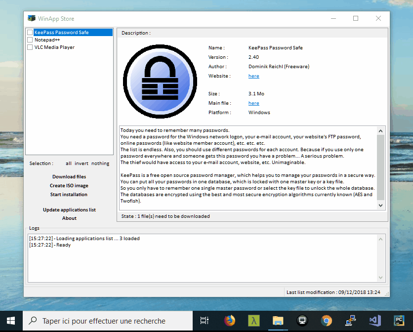

# WinApp

  <!-- Stability -->
  
  <!-- Standard -->
  

 

WinApp makes easier the installation and management of your applications !

The database of applications is contained in a remote XML file and you can update this file in one click.

Instruction to uninstall the previous version and to install the current is also in the XML file. Installations are performed silently as configured in the XML file using silent switches. (cf. the example).

It is also possible to create an ISO file using mkisofs of your applications.

The tool may need some security improvements :smile:.

Date: around 2008

If you like this kind of tool, try <a href="https://chocolatey.org/">Chocolatey</a>.

## Components

- <a href="https://github.com/mike-lischke/GraphicEx">GraphicEx</a> (version for D2009).

- <a href="https://github.com/masterandrey/TRegExpr">TRegExpr</a> (version of 2004).

## Compilation

Install GraphicEx and TRegExpr.

Then compile the project as usual.

## Example

